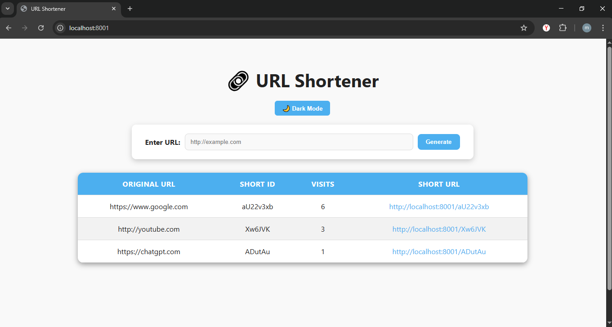
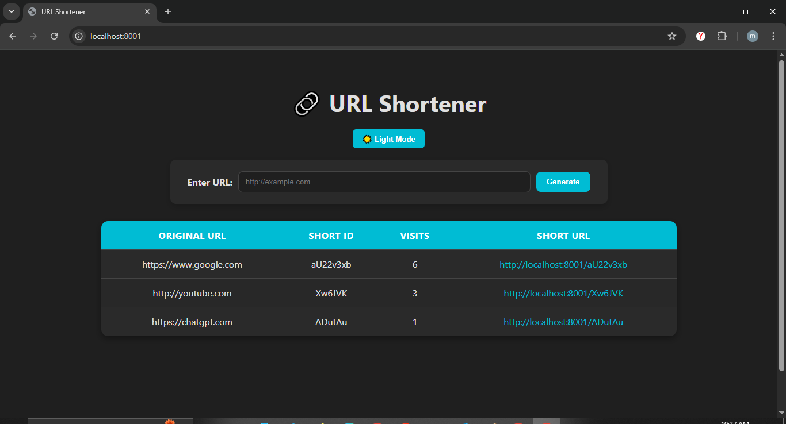

# 🔗 URL Shortener

A simple and efficient **URL Shortener** built with **Node.js, Express, MongoDB, and EJS**.  
Users can enter a long URL, and the app generates a short ID that redirects to the original link.  
It also tracks how many times each short link has been visited.  

---

## ✨ Features
- Shorten long URLs into unique short IDs  
- Redirect short links to the original URL  
- Track visit counts for each short URL  
- Clean and responsive **EJS frontend**  
- Light/Dark theme toggle for the UI  

---

## 📸 Demo (Screenshots)
| Light Theme | Dark Theme |
|-------------|------------|
|  |  |

*(Add screenshots later — keep them inside a `/docs` folder)*

---

## 🛠️ Tech Stack
- **Backend:** Node.js, Express.js  
- **Database:** MongoDB + Mongoose  
- **Frontend:** EJS Templates + CSS  
- **Other Tools:** nanoid (for short IDs)  

---

## ⚙️ Installation & Setup

### 1️⃣ Clone the repository
```bash
git clone https://github.com/bhaskar-f/url-Shortner.git
cd url-Shortner
```
--- 

### 2️⃣ Install dependencies
```bash
npm install
```
---

### 3️⃣ Setup Environment Variables

Create a .env file in the project root:
```env
PORT=8001
MONGO_URI=mongodb://localhost:27017/url-shortner
```
---

### 4️⃣ Run the server
```bash
npm start
```

Now the server will run at 👉 http://localhost:8001

---

## 🚀 Usage

- Open the app in your browser.

- Enter any long URL in the input field.

- Click Generate Link.

- Copy and share your short URL.

- Track visit counts in the dashboard table.

---

## 📂 Project Structure
```csharp
url-shortner/
│
├── models/             # Mongoose models
│   └── url.js
├── routes/             # Express routes
│   └── urlRoutes.js
├── views/              # EJS templates
│   ├── index.ejs
│   └── ...
├── public/             # Static assets (CSS, JS, images)
├── server.js           # Entry point
├── package.json
└── README.md
```
---

## 📈 Future Improvements

 - Add user authentication (login to manage links)

 - Add QR code generator for short URLs

 - Analytics dashboard (clicks by country, device, etc.)

 - Custom alias option (choose your own short ID)

---

## 🤝 Contributing

- Pull requests are welcome!
- For major changes, please open an issue first to discuss what you’d like to change.

---

## 📜 License

- This project is licensed under the MIT License.
- You’re free to use, modify, and distribute it.

---

#### 👨‍💻 Made with ❤️ by Bhaskar


